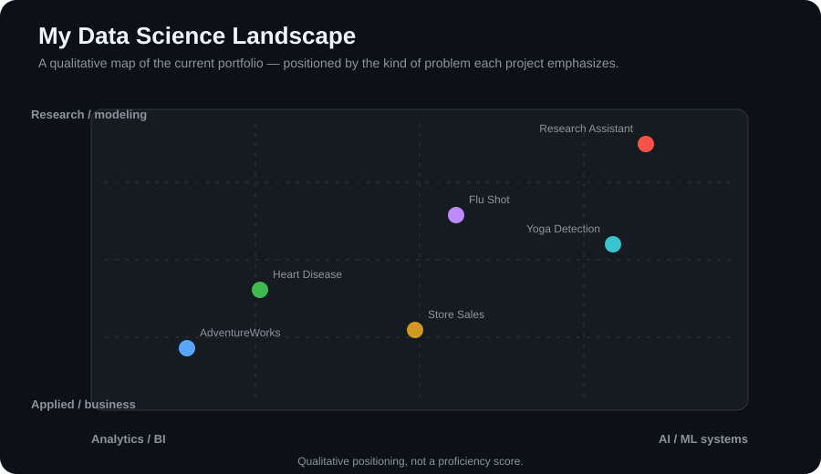
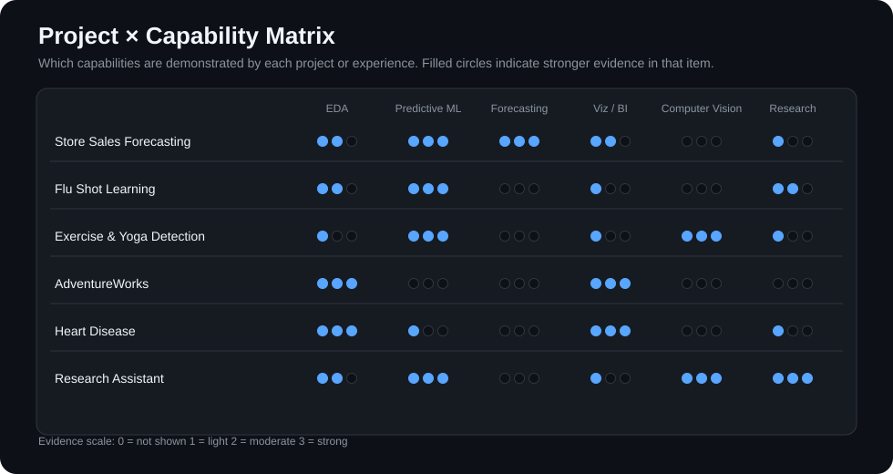
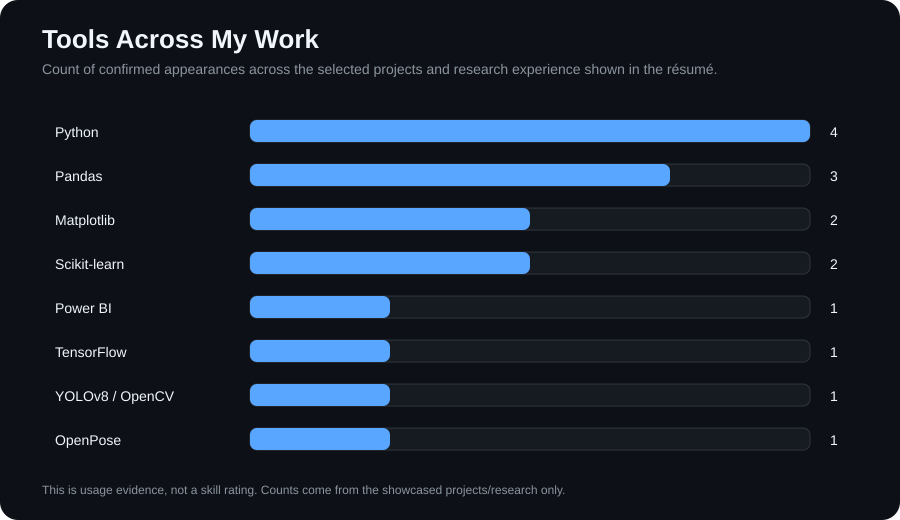
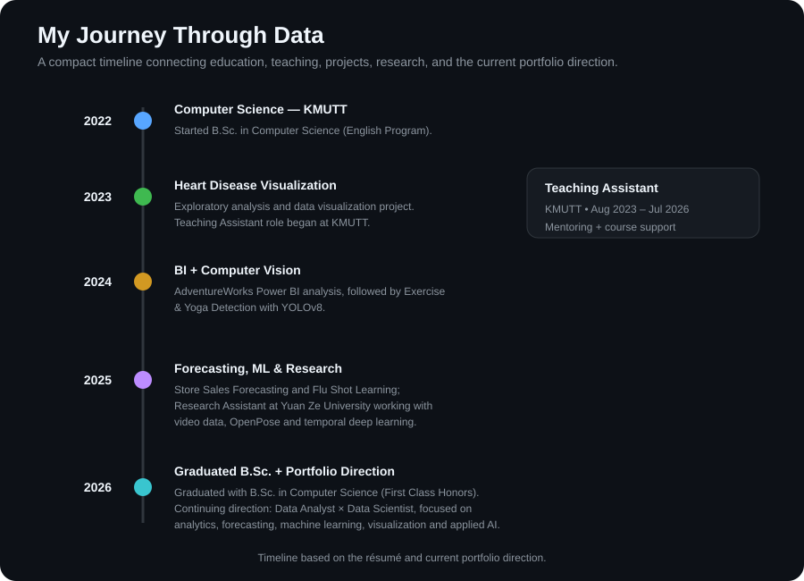

# Hi, I'm Nay Lin Htun 👋

### Data Analyst × Data Scientist

**Questions → Evidence → Insights → Decisions**

I enjoy turning messy real-world data into meaningful analysis, predictive models, and actionable insights.

---

## 🔎 How I Think About Data

<table>
<tr>
<td width="50%" valign="top">

### 🔍 Ask

**What problem are we solving?**

- What changed?
- Why did it change?
- Who is driving it?
- What should we investigate?

</td>

<td width="50%" valign="top">

### 🧹 Verify

**Can the data be trusted?**

- Missing values
- Duplicates
- Outliers
- Definitions
- Data consistency

</td>
</tr>

<tr>
<td width="50%" valign="top">

### 📊 Analyze

**What is really happening?**

- Trends
- Segmentation
- Correlations
- Cohorts
- Anomalies

</td>

<td width="50%" valign="top">

### 🎯 Decide

**What should happen next?**

- Explain findings
- Measure impact
- Recommend actions
- Communicate clearly

</td>
</tr>
</table>

---

## 🧭 What I Work On

<table>
<tr>
<td width="25%" align="center" valign="top">

## 📊    Analytics

SQL  
EDA  
Business Intelligence  
Customer Analysis  

</td>

<td width="25%" align="center" valign="top">

## 🔮    Predictive

Machine Learning  
Forecasting  
Classification  
Regression  

</td>

<td width="25%" align="center" valign="top">

## 👁️    AI / Vision

Computer Vision  
YOLO  
Pose Detection  
Deep Learning  

</td>

<td width="30%" align="center" valign="top">

## 📈    Visualization

Power BI  
Matplotlib  
Plotly  
Data Storytelling  

</td>
</tr>
</table>

---

## 🧰 Analyst Toolbox

| Purpose | Tools |
|---|---|
| Query & Analysis | `SQL` `Python` `Pandas` `NumPy` `R` |
| Statistics & ML | `Scikit-learn` `LightGBM` `CatBoost` `TensorFlow` `Keras` |
| Visualization | `Power BI` `Matplotlib` `Plotly` |
| Data Platforms | `Snowflake` `SQL Server` |
| Computer Vision | `OpenCV` `YOLOv8` `Roboflow` `CVAT` `OpenPose` |
| Workflow | `Git` `GitHub` |

---
## 📊 Portfolio at a Glance

  

  

  

## 📍 My Journey Through Data

  

---

## 📫 Connect

I'm interested in opportunities and collaborations involving **Data Analytics, Data Science, Machine Learning, Business Intelligence, and AI**.

---

### `data → evidence → insight → decision`

